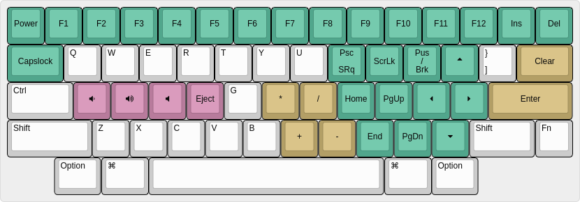

# Baliem-keyberon  

A hand wired hhkb layout keyboard. it uses [keyberon](https://gtihub.com/Texitoi/keyberon) for its firmware.


2nd layer



## Material
  - a STM32F103C8T6 aka blue pill
  - Acrylic Sandwich case you can find it at dxf folder
  - 60 Cherry MX compatible keyboard switch
  - 10 M3 screw
  - 60 1N4148 diodes
  - Soldering kit

## KLE json
this is the raw data for [keyboard layout](http://www.keyboard-layout-editor.com/). 
```json
["esc","!\n1","@\n2","#\n3","$\n4","%\n5","^\n6","&\n7","*\n8","(\n9",")\n0","_\n-","+\n=","|\n\\","~\n`"],
[{w:1.5},"Tab","Q","W","E","R","T","Y","U","I","O","P","{\n[","}\n]",{w:1.5},"Delete"],
[{w:1.75},"Ctrl","A","S","D","F","G","H","J","K","L",":\n;","\"\n'",{w:2.25},"Return"],
[{w:2.25},"Shift","Z","X","C","V","B","N","M","<\n,",">\n.","?\n/",{w:1.75},"Shift","Fn"],
[{x:1.25,w:1.25},"Option",{w:1.25},"⌘",{a:7,w:6.25},"",{a:4,w:1.25},"⌘",{w:1.25},"Option"]

```

## Wiring

Current wiring based on layout in layout.rs


## PIN OUT


## Compiling

Install the rust toolchain, currently keyberon run on rust 1.47.0 [issue](https://github.com/TeXitoi/keyseebee/issues/8#issuecomment-738706670)
```shell
curl https://sh.rustup.rs -sSf | sh
rustup toolchain install 1.47.0
rustup target add thumbv7m-none-eabi --toolchain 1.47.0
rustup component add llvm-tools-preview --toolchain 1.47.0
rustup run 1.47.0 cargo install cargo-binutils
```

Compile the firmware
```shell
rustup run 1.47.0 cargo objcopy --bin baliem --release -- -O binary baliem60.bin
```

## Flashing using DFU

Put the keyboard into flashing mode. (hit the reset button on the blue pill). Then flash it:
```shell
sudo dfu-util -d 1eaf:0003 -a 2 -D baliem60.bin
```

Push reset and the keyboard was ready to go.

## Notes

reflash bootloader:
```shell
openocd -f interface/stlink-v2.cfg -f target/stm32f1x.cfg -c "init; reset halt; stm32f1x mass_erase 0; program generic_boot20_pc13.bin exit 0x08000000"
```